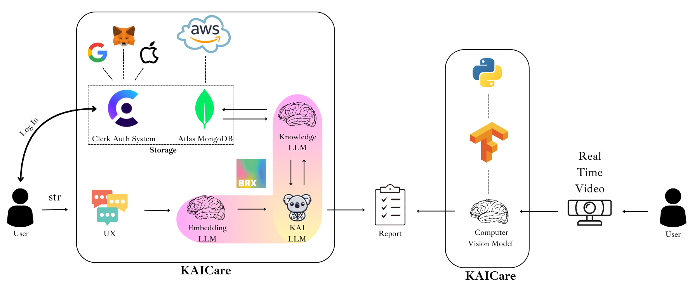

# KAICare

The very first AI-powered physical therapy platform that helps you recover from injuries, improve your performance, and prevent future injuries.

KAICare is a compassionate haven where cutting-edge technology and empathetic care converge. Led by our AI companion, KAI the koala, we empower patients on their healing journey.

Features:
- KAI (AI Assistant) - KAI is an AI-powered assistant that helps you with your physical recovery when you need it the most. KAI will guide you through your recovery process, provide you with personalized exercises, and track your progress.
- Personal Trainer - Computer Vision-aided agent that corrects your pose while doing your recovery exercises.

## About the team
This application has been developed by 5 Illinois Institute of Technology engineer graduate students for the Orahacks hackathon that took place in April 2024.
- Si Qiang Wu Yang | [LinkedIn](https://www.linkedin.com/in/siqiangwu) | siqiangwu@gmail.com | Computer Vision Developer & Design 
- Chenglong (Oskar) Wu Yang | [LinkedIn](https://www.linkedin.com/in/cwuyang) | cwuyang@hawk.iit.edu | Front/Web3 Developer & Design 
- Mario de Lucas Garcia | [LinkedIn](https://www.linkedin.com/in/mdelucasg) | delucasgarcia.mario@gmail.com | LLM/Front Developer & Design 
- Ignacio Gomez Valverde [LinkedIn](https://www.linkedin.com/in/ignacio-gomez-valverde/) | ignacio.gvalverde@gmail.com | DB/LLM Developer & Design 
- Laura Serrano Velazquez | [LinkedIn](https://www.linkedin.com/in/lauraserranovelazquez) | lauraserranovelazquez@gmail.com | Front Developer & Design 

## Technologies



- **Tailwind**: Design, animations and effects
- **Clerk**: User Authentication with Google, Apple & MetaMask
- **Web3**: Use of authentication through MetaMask
- **Atlas MongoDB**: LLM knowledge storage & vector similarity search
- **AWS**: Host for the MongoDB cluster
- **BRX.AI**: LLM deployment
- **AI**: LLM & Computer Vision
- **AI Framework**: TensorFlow

## Web navigation
The following figure shows the flow possibilities currently configured in KAICare Web


## Set Up & Deployment
To run the program, the following steps must be performed. 

1. Clone the repository
```shell
git clone https://github.com/KaiCare/web.git 
cd web
```

2. Install the necessary packages - via `npm` package manager
```shell
npm install
```
If the previous command gives an error, it is probably because you do not have npm installed.

3. Setup `.env` file

To facilitate the creation of the .env file with the necessary data to run KAICare we have created a configuration.py file that checks if the .env file is already created and if not it creates it with all the necessary information inside. 
```shell
python3 configuration.py
```
4. Start Computer Vision model
```shell
cd server
python3 Exercise_detector.py
```

5. Deploy the app - http://localhost:3000
```shell
cd
npm run dev
```
